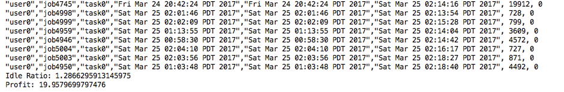

## Cloud Virtual Service Provider Project

### How to Install and Compile
#### Install Java 8  
Please refer to https://docs.oracle.com/javase/8/docs/technotes/guides/install/install_overview.html  

#### Install Maven  
Please refer to https://maven.apache.org/install.html

#### Compile  
In command line, enter  
`mvn clean package`  
After compiling finished, you can find the jar file in target folder.

### How to Run  
`java -cp target/cvsp-1.0.jar cvsp.UserInterface`  

You can choose to run demo simulation or your customized simulation
#### Run Demo (Experiments for parameters in the paper)

#### Customized Simulation  
You can choose from three type of simulations  
You will be asked to enter parameters needed.
  
......

The program will show the submit time, start time, end time, runtime and waitting of each task.
CSV file of each record will also be generated at the same directory of the program.

### Code Structure
CVSP Package contains basic classes required by simulations.  
  

models package contains stochastic models for simulations  
  

