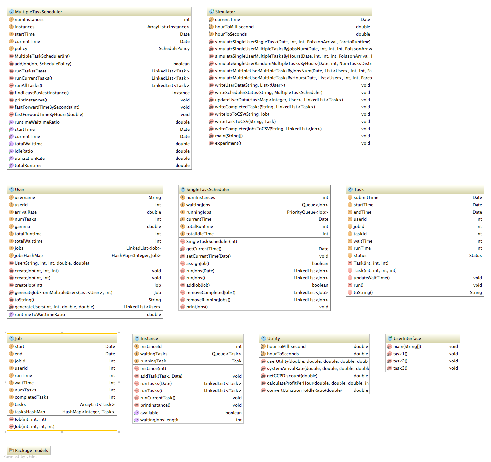
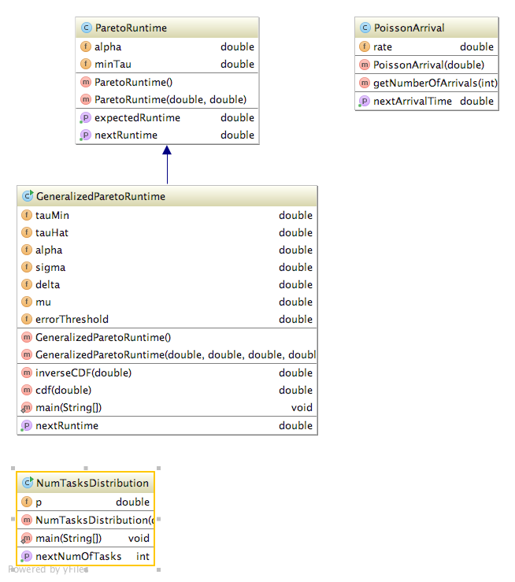

## Cloud Virtual Service Provider (CVSP)
### Paper  
[Zheng Liang, Carlee Joe-Wong, Christopher G. Brinton, Chee Wei Tan, Sangtae Ha, and Mung Chiang. "On the Viability of a Cloud Virtual Service Provider." In Proceedings of the 2016 ACM SIGMETRICS International Conference on Measurement and Modeling of Computer Science, pp. 235-248. ACM, 2016.](http://www.princeton.edu/~liangz/paper/CVSP_SIGMETRICS.pdf)  
### How to Install and Compile
#### Install Java 8  
Please refer to https://docs.oracle.com/javase/8/docs/technotes/guides/install/install_overview.html  

#### Install Maven  
Please refer to https://maven.apache.org/install.html

#### Compile  
In command line, enter  
`mvn clean compile assembly:single`  
After compiling finished, you can find the jar file in target folder.

### How to Run  
`java -cp target/cvsp-1.0.jar cvsp.UserInterface`  

You can choose to run demo simulation or your customized simulation
#### Run Demo (Experiments for parameters in the paper)

#### Customized Simulation  
You can choose from three type of simulations  
You will be asked to enter parameters needed.
  
......

The program will show the submit time, start time, end time, runtime and waitting of each task.
CSV file of each record will also be generated at the same directory of the program.

### Code Structure
CVSP Package contains basic classes required by simulations.  
  

models package contains stochastic models for simulations  
  

### Experiments Results  

Idle Ratios Versus Number of Tasks  
  

Profits Versus Number of Tasks  
  

Idle Ratios Evolement with Time Example  
  
